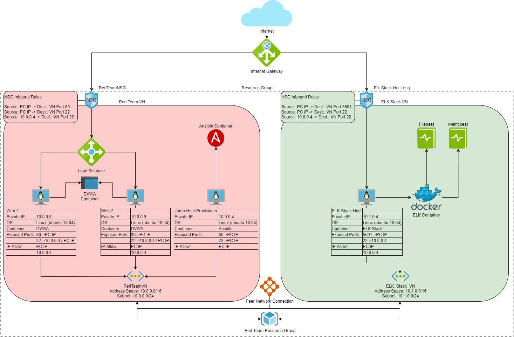
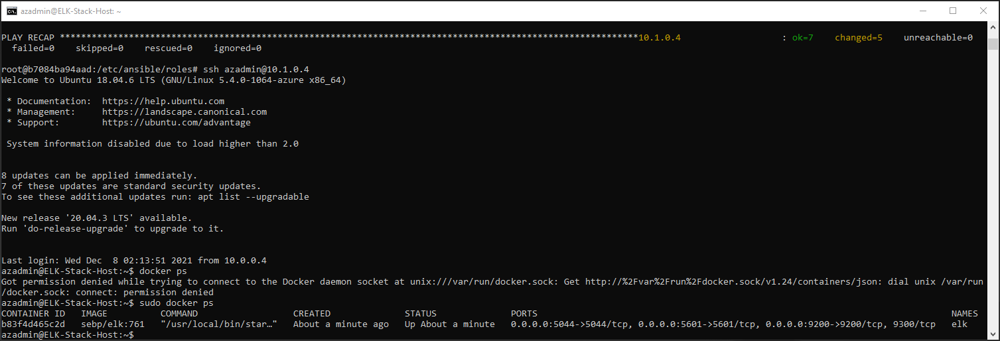

## Automated ELK Stack Deployment

The files in this repository were used to configure the network depicted below.

These files have been tested and used to generate a live ELK deployment on Azure. They can be used to either recreate the entire deployment pictured above. Alternatively, select files of the below YAML playbooks may be used to install only certain pieces of it, such as Filebeat.

  - 
  - 
  - 
	  - 
  - 
	  - 

This document contains the following details:
- Description of the Topology
- Access Policies
- ELK Configuration
  - Beats in Use
  - Machines Being Monitored
- How to Use the Ansible Build

### Description of the Topology

The main purpose of this network is to expose a load-balanced and monitored instance of DVWA, the D*mn Vulnerable Web Application.

Load balancing ensures that the application will be highly available, in addition to restricting access to the network. Load balancers help protect the availability of a website to users by making sure the traffic to servers hosting a website is regulated and balanced so that one server is not overloaded compared to another. The advantage of having a jump box is in having a single hardened device that will be able to perform network wide tasks which increases overall network security.

Integrating an ELK server allows users to easily monitor the vulnerable VMs for changes to the logs and system metrics.
- Filebeat forwards and centralizes log data. It monitors the any log files or locations that  you specify as well as collecting log events.
- Metricbeat collects metrics from your systems and services. This includes CPU, Memory, Redis, NGINX, and more. 

The configuration details of each machine may be found below.

| Name                 | Function     | IP Address | Operating System |
|----------------------|--------------|------------|------------------|
| Jump-Box-Provisioner | Gateway      | 10.0.0.4   | Linux            |
| Web-1                | DVWA Server 1| 10.0.0.8   | Linux            |
| Web-2                | DVWA Server 2| 10.0.0.9   | Linux            |
| ELK-Stack-Host       | ELK Server   | 10.1.0.4   | Linux            |

### Access Policies

The machines on the internal network are not exposed to the public Internet. 

Only the Jump-Box-Provisioner machine can accept connections from the Internet. Access to this machine is only allowed from the following IP addresses:
- Personal Computer (PC) IP Address

Machines within the network can only be accessed by SSH.
- The ELK-Stack-Host is accessible by SSH from the Jump-Box-Provisioner as well as by web access via port 5601 from the PC IP Address

A summary of the access policies in place can be found in the table below.

| Name                 | Publicly Accessible | Allowed IP Addresses |
|----------------------|---------------------|----------------------|
| Jump-Box-Provisioner |       Yes           | PC IP, 10.0.0.4      |
| Web-1                |       Yes           | PC IP, 10.0.0.4      |
| Web-2                |       Yes           | PC IP, 10.0.0.4      |
| ELK-Stack-Host       |       Yes           | PC IP, 10.0.0.4      |

### Elk Configuration

Ansible was used to automate configuration of the ELK machine. No configuration was performed manually, which is advantageous because this allows us to control the configuration of the system on one secure machine. It also gives us the ability to configure multiple machines at the same time, with the same exact criteria, which is much more efficient and controls the possibility of mistakes to one location. 

The 'install-elk' playbook implements the following tasks:
- Installs Docker.io and Python3
- Installs the Docker Module
- Increases the virtual memory to run the ELK stack properly
- Downloads and launches a Docker ELK Container
- Sets the Published Ports

The following screenshot displays the result of running `docker ps` after successfully configuring the ELK instance.

### Target Machines & Beats
This ELK server is configured to monitor the following machines:
- Web-1 10.0.0.8
- Web-2 10.0.0.9

We have installed the following Beats on these machines:
- Filebeat
- Metricbeat

These Beats allow us to collect the following information from each machine:

- Filebeat will collect logs on any particular file you need to observer. This can include timestamps on files, users, SSH authentications, etc.
	- For example `system.auth.ssh.event`, can be used to track the SSH events found in the logs (Accepted, Invalid, Failed, etc.)
	
- Metricbeat will collect any type of system metric you specify. This can include information related to CPU usage, Memory usage, etc.
	- For example  `system.core.idle.pct`, will give you the percentage of CPU time spent idle.  

### Using the Playbooks
In order to use the playbook, you will need to have an Ansible control node already configured. Assuming you have such a control node provisioned: 

SSH into the control node and follow the steps below:
- Copy the filebeat-config.yml and metricbeat-config.yml file to /etc/ansible/files.
- Update the above configuration files to include the Private IP of the ELK-Stack-Host machine in the ElasticSearch and Kibana sections of the files. 
- Run the playbook, and navigate to the Public IP Address of the ELK-Stack-Host machine directly to port 5601 to check that the installation worked. 
	- (ex. http://40.125.230.32:5601/app/kibana) Here 40.125.230.32 is an example Public IP Address, replace this with the Public IP of you ELK-Stack-Host machine

- There are 4 playbooks above ( install-python-docker-container.yml, install-elk.yml, install-filebeat.yml, install-metricbeat.yml) all of these should be copied to your Jump-Box-Provisioner machine in this location: 
	- /etc/ansible/

- In order to specify the machine on which to run the Ansible playbook you must update the below file and add the Private IP Address of the machine you want to run the playbook on, specifically we have a 'group' created with square brackets and under this 'group' you can add the IP Address and then just use the group name at the top of the playbook.
	- /etc/ansible/hosts.cfg

- In order to check that the ELK Server is running you need to navigate to the ELK-Stack-Host via web browser:
	- (ex. http://40.125.68.10:5601/app/kibana) Here 40.125.68.10 is an example Public IP Address, replace this with the Public IP of you ELK-Stack-Host machine

